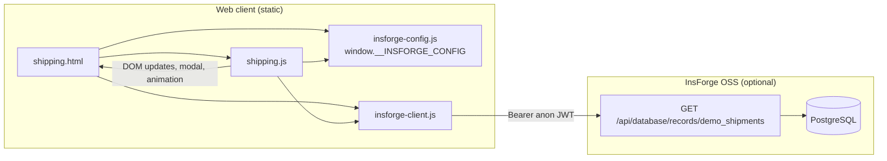

# Academic Project Report

**Project name (repository):** Shiprocket-Style Logistics Platform Demo (`shiprocket-style-demo`)

**Document purpose:** Final college presentation and evaluation support. Content is derived from the repository codebase only.

---

## 1. Abstract and Introduction

### Abstract

This repository delivers a **static, browser-side** logistics-style user experience: a marketing-style homepage and a detailed **shipping and tracking** product page. The core design combines **presentation-layer fidelity** with an **optional** integration path: when InsForge OSS is configured, tracking identifiers resolve against server-side rows in `demo_shipments`; otherwise a deterministic **client-side mock** timeline is shown. The work demonstrates how a student or portfolio project can balance **UI realism** with **controlled backend scope** using a Backend-as-a-Service (BaaS) pattern instead of a custom application server.

### Introduction

**Problem statement.** Logistics dashboards in industry depend on carrier APIs, authentication, and operational databases. For an academic demo, a purely static mock often lacks **data credibility**, while building a full custom backend increases scope, deployment risk, and evaluation surface beyond the UI learning objectives.

**Proposed solution.** The project uses vanilla HTML, CSS, and JavaScript. Optional InsForge exposes PostgreSQL-backed **seeded demo rows** through a REST records API, with Row Level Security (RLS) policies on `demo_shipments`. A minimal browser client (`insforge-client.js`) performs authenticated GET requests; `shipping.js` implements validation, modal presentation, and step-wise timeline animation.

**Core objectives (code-aligned).**

1. Multi-tab tracking entry: AWB, Order ID, Mobile (`shipping.js`, `TAB_CONFIG`).
2. Optional database-backed resolution of demo shipments (`tryInsForgeThenMock` in `shipping.js`).
3. Accessible staggered timeline visualization inside a `<dialog>` (`createStepLi`, `runStaggerAnimation`).
4. Repeatable local setup documented in `docs/INSFORGE_LOCAL.md`, with schema and seed data in `migrations/`.

---

## 2. Technology Stack

Evidence is taken from repository files: `package.json`, HTML pages, JavaScript modules, SQL migrations, and `docs/INSFORGE_LOCAL.md`.

| Layer | Technologies or artifacts | Evidence |
|--------|---------------------------|----------|
| **Frontend** | Vanilla HTML, CSS, client JavaScript; no SPA framework declared in `package.json` | `index.html`, `shipping.html`, `script.js`, `shipping.js` |
| **In-repository application backend** | None; no Express or similar server as the app backend | Repository layout; `package.json` has no `dependencies` block |
| **Optional BaaS** | InsForge OSS REST (`/api/database/records/...`), anonymous JWT | `insforge-client.js`, `scripts/print-insforge-anon-token.cjs`, `docs/INSFORGE_LOCAL.md` |
| **Database** | PostgreSQL schema, indexes, RLS, seed `INSERT` / `UPDATE` | `migrations/*.sql` |
| **Tooling** | Static HTTP via `npx serve`; Node for token helper | `package.json` scripts: `serve`, `insforge:anon-token` |

**Note:** `package.json` does not list npm package `dependencies`. Runtime assumes a modern browser and, optionally, Node.js for InsForge CLI usage and the anon token script.

---

## 3. System Architecture and Workflow

### Narrative overview

The user opens `shipping.html` and enters a tracking reference. `shipping.js` applies validation (non-empty input, rejection of pasted URLs on non-mobile paths, ten-digit rule for the mobile tab). If `window.insforgeIsEnabled()` is true (configuration includes `enabled`, `baseUrl`, and `anonAccessToken`), the page calls `insforgeQueryRecords` with PostgREST-style filters. On a matching row, header fields and the `steps` JSON array populate the modal. If no row matches, InsForge is disabled, or the request fails, the UI falls back to built-in `MOCK_STEPS` and tab-level presentation defaults, with explicit fallback copy via `setFallbackNote`.

### Mermaid diagram: components and data flow



---

## 4. Implementation Details (Critical Modules)

### Module A: Shipping page controller (`shipping.js`)

- **Tab configuration:** `TAB_CONFIG` and `TAB_PRESENTATION` drive placeholders, `inputmode`, labels, and default status and partner strings. `setActiveTab` updates button `active` state and `aria-selected`.
- **URL prefill:** `URLSearchParams` reads `prefill` and `type` from the query string when both match a known tab.
- **InsForge path:** `tryInsForgeThenMock` queries the configured table (default `demo_shipments`) with `reference` and `tab_key` filters. `pickDemoShipmentRow` selects the row where both fields match the user reference and active tab. If the active tab is AWB and the reference matches `ORD-` prefix, a second fetch uses tab key `order` and the UI may switch tab automatically.
- **Header population:** `populateHeader` prefers database fields (`id_label`, `courier`, `status_text`, snake or camel case) over tab defaults.
- **Timeline DOM:** `createStepLi` constructs list items; `applyStepProgress` toggles CSS modifier classes. `runStaggerAnimation` uses `STEP_MS = 580` and stores timeout ids in `staggerTimers`; `closeTrackingModal` and dialog `close` clear timers to avoid leaks and stale animations.

### Module B: InsForge minimal client (`insforge-client.js`)

- Exposes `window.insforgeQueryRecords(table, filters)` and `window.insforgeIsEnabled()`.
- Builds `GET` URL: base URL plus `/api/database/records/` plus encoded table name and `URLSearchParams` from filters (e.g. `eq.` operators).
- **Response normalization:** `normalizeRows` returns an array from a raw array, or from `body.value`, or from `body.data`, otherwise an empty array.
- Non-OK HTTP responses throw after reading response text for diagnostics.

### Module C: Runtime configuration (`insforge-config.js`, `insforge-config.example.js`)

- Sets `window.__INSFORGE_CONFIG` with `enabled`, `baseUrl`, `anonAccessToken`, and `demoTable`.
- The example file documents copying to a local gitignored config and loading order relative to `insforge-client.js`.

### Module D: Schema and data (`migrations/20260513162102_shiprocket-demo.sql` and follow-ups)

- **Table `public.demo_shipments`:** `id` UUID default `gen_random_uuid()`, `reference` text, `tab_key` text with `CHECK (tab_key IN ('awb', 'order', 'mobile'))`, `courier`, `id_label`, `status_text`, `steps` `jsonb` default `[]`, `created_at` timestamptz default `now()`.
- **Index:** `(reference, tab_key)`.
- **RLS:** enabled; `SELECT` and `INSERT` policies for roles `anon` and `authenticated` as defined in the migration file.
- **Grants:** `USAGE` on schema `public`; `SELECT`, `INSERT` on `demo_shipments` for `anon` and `authenticated`.
- Later migrations add diverse seed rows and `UPDATE` statements so timeline `steps` align with header semantics documented in SQL comments (last step treated as current stage in the UI after animation).

### Module E: Homepage and shared UX (`script.js`)

- Mobile drawer: toggle, backdrop click, body scroll lock, `aria-expanded` on the menu control, optional drawer close control.
- **Hero carousel:** `heroSlides` array drives image src, alt, and floating badge labels or values; modulo navigation via `goToSlide`; five-second auto-advance with reset on manual navigation.
- **FAQ:** single-open accordion by removing `active` from siblings before toggling the clicked item.

---

## 5. Setup and Execution

**Prerequisites:** Node.js (for `npx` and `node`), a modern web browser, terminal access.

### 5.1 Static site only (mock tracking)

```bash
cd "d:\AK47\Officials\Development\Projects\Shiprocket"
npm run serve
```

Equivalent:

```bash
npx --yes serve .
```

Open the printed `http://localhost:...` URL in the browser. Navigate to `shipping.html` as needed.

### 5.2 Optional: InsForge-linked database-backed demo

1. Link the project (once per machine):

```bash
npx @insforge/cli link --api-base-url "<your projectUrl>" --api-key "<accessApiKey>"
```

2. Apply migrations from this repository:

```bash
npx @insforge/cli db migrations up --all -y
```

3. Print an anonymous JWT for browser use:

```bash
npm run insforge:anon-token
```

4. Edit `insforge-config.js` (or use a local override pattern described in `insforge-config.example.js` and `docs/INSFORGE_LOCAL.md`): set `enabled: true`, set `baseUrl` to your OSS host, set `anonAccessToken` to the printed token, and keep `demoTable` as `demo_shipments` unless you changed the table name.

**Environment variables:** The static pages do not load a `.env` file for browser configuration; values are supplied through `window.__INSFORGE_CONFIG`. CLI credentials live in `.insforge/project.json` (documented as not for public commit).

### 5.3 Demo reference values

See the reference table in `docs/INSFORGE_LOCAL.md` for AWB, Order ID, and Mobile examples and expected status lines.

---

## Integrity Note

Do not commit production API keys or long-lived tokens. Prefer `insforge-config.local.js` and gitignore rules as described in `docs/INSFORGE_LOCAL.md` and `insforge-config.example.js`. This report does not reproduce any live credentials.

---

## References (in-repository)

| Topic | Path |
|--------|------|
| Shipping logic | `shipping.js` |
| InsForge HTTP client | `insforge-client.js` |
| Browser config | `insforge-config.js`, `insforge-config.example.js` |
| Anon token script | `scripts/print-insforge-anon-token.cjs` |
| InsForge local guide | `docs/INSFORGE_LOCAL.md` |
| Initial schema and seed | `migrations/20260513162102_shiprocket-demo.sql` |
| Additional seed rows | `migrations/20260513171253_demo-shipment-variations.sql` |
| Step and status alignment | `migrations/20260514103000_demo-shipment-steps-align-status.sql` |
| Homepage and FAQ behavior | `script.js` |
| NPM scripts | `package.json` |
