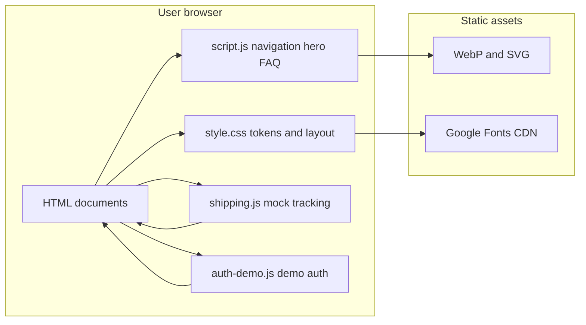

# Academic Project Report

**Project title:** Shiprocket-Style Logistics Platform (Static UI Prototype)

**Document type:** Technical report for final-year presentation and evaluation

---

## 1. Abstract and Introduction

### Abstract

This work presents a static web prototype of a logistics and eCommerce enablement platform, visually and structurally aligned with the Shiprocket brand experience. The system delivers marketing and product-education surfaces (home, shipping, pricing, resources, solutions) together with illustrative login and signup flows. Interaction is implemented entirely in the browser through semantic HTML5, a token-based Cascading Style Sheets (CSS) design system, and unobtrusive JavaScript modules. A mock parcel-tracking workflow demonstrates user-interface patterns for multi-tab input, validation, modal results, and staged timeline animation without persistence or external courier integration.

### Problem Statement

Academic and portfolio contexts often require a tangible artifact that communicates complex logistics software value propositions (coverage, tracking, integrations) while remaining feasible without enterprise infrastructure. A full-stack clone is neither necessary nor proportionate for demonstrating visual design discipline, responsive layout, accessibility-minded controls, and front-end state patterns.

### Proposed Solution

A **static-site architecture**: discrete HTML documents share one global stylesheet and small, page-scoped scripts. Cross-cutting navigation, hero carousel, and FAQ behaviour live in `script.js`. Shipping-specific tracking demo logic is isolated in `shipping.js`. Authentication **demonstration** (validation plus modal acknowledgement) is confined to `auth-demo.js`.

### Core Objectives

1. Reproduce a credible, responsive marketing and product surface with consistent typography (Google Fonts: Manrope, Sora) and tokenised colour roles (`RULEBOOK.md`, `:root` in `style.css`).
2. Implement an educational **order status** visual using synchronised CSS keyframes (documented in `SHIPPING_PAGE_SECTIONS.md`).
3. Provide a **mock tracking** path: tab configuration, input validation, `<dialog>` presentation, and programmatic step highlighting (`shipping.js`).
4. Maintain **progress documentation** for phased delivery (`TASKS.md`, `Home_Page_Documentation`).

---

## 2. Technology Stack (Evidence-Based)

### Frontend

- **Markup:** HTML5 documents (`index.html`, `shipping.html`, `login.html`, `signup.html`, `pricing.html`, `resources.html`, `solutions.html`).
- **Styling:** Single primary stylesheet `style.css`; optional captured reference stylesheet `shiprocket.in-styles-2026-04-30.css` (present in repository; include in scope only if the evaluation explicitly covers reference assets).
- **Scripting:** ECMAScript in the browser; no transpiler or bundler is evidenced in the repository.
- **Fonts:** Google Fonts links in each HTML `<head>` (families **Manrope**, **Sora**).
- **Media:** SVG and WebP under `assets/` (referenced from `script.js` hero slide configuration).

### Backend

- **Not implemented** in this repository.

### Database

- **Not implemented**; no schema migrations or data store.

### Deployment and Runtime

- **Static hosting** or local file preview: any HTTP static file server suffices. No container or continuous integration configuration was identified in the explored project tree.

**Note on dependency manifests:** The repository contains no `package.json` or `requirements.txt`. The stack is inferred from linked HTML, CSS, and JavaScript files.

---

## 3. System Architecture and Workflow

### High-Level Description

The user agent loads an HTML document. The browser fetches shared `style.css` and one or two scripts per page (`script.js` on all reviewed pages; `shipping.js` on `shipping.html`; `auth-demo.js` on login and signup with `data-auth-page` on `<body>`). Rendering combines DOM structure, CSS layout and animation, and event-driven JavaScript. There is no network round-trip for application logic beyond font and static asset requests.

### Mermaid: Component Interaction

---

## 4. Implementation Details (Critical Modules)

### Module A: Global Chrome and Homepage Interactions (`script.js`)

- **Mobile navigation:** toggles `.show` on `#navLinks`, synchronises a programmatic `.menu-backdrop`, locks `document.body.style.overflow`, updates `aria-expanded` on `#menuToggle`.
- **Hero carousel:** array `heroSlides` holds `{ src, alt, badges }`; `goToSlide` uses modular indexing `(index + length) % length`; `setInterval` every 5000 ms for auto-advance; dot `data-slide` drives direct index selection.
- **FAQ accordion:** single-open pattern: on question click, all `.faq-item` lose `active`, then the current item toggles if it was closed.

### Module B: Shipping Mock Tracking (`shipping.js`)

- **Configuration maps:** `TAB_CONFIG` (placeholder and `inputmode`), `TAB_PRESENTATION` (labels and demo partner strings), `MOCK_STEPS` (static timeline copy).
- **URL prefill:** `URLSearchParams` reads `prefill` and `type`; `setActiveTab` and decoded value populate the field when valid.
- **Validation:** empty input error; mobile branch requires exactly 10 digits after non-digit stripping.
- **Timeline animation:** `renderStepsPending` builds list items; `applyStepProgress` assigns CSS state classes by index; `runStaggerAnimation` schedules `setTimeout` chains at `STEP_MS = 580` ms; `clearStaggerTimers` on modal close prevents stale updates.
- **Modal:** native `<dialog>` with `showModal` / `close` fallback for older engines.

### Module C: Order Status Motion System (`style.css`)

- **Synchronised 10 s loop:** `.flow-step` children use `step1_loop` through `step5_loop` each with `10s infinite`; connectors use `conn*_loop` and `::before` energy dots `dot*` on the same period, reducing per-element delay drift (as documented in `SHIPPING_PAGE_SECTIONS.md`).

### Module D: Authentication Demo (`auth-demo.js`)

- **Page dispatch:** reads `document.body.dataset.authPage`; branches `login` versus `signup`.
- **Login:** 10-digit phone check on `#loginBusinessForm`; separate tracking field syncs placeholder from radio `name="login-track-type"`; successful track navigates to `shipping.html?prefill=…&type=…` via `encodeURIComponent`.
- **Signup:** non-empty name, `EMAIL_RE` regex, 10-digit phone; success opens the same demo dialog pattern.

---

## 5. Setup and Execution

### Prerequisites

- A modern web browser.
- Optional: Node.js or Python or an editor live-server extension, only to serve files over HTTP (some browser features behave more predictably with `http://` than `file://`).

### Install Dependencies

- **Not applicable:** there is no `npm install` or `pip install -r requirements.txt` for this repository.

### Environment Variables

- **None** required for local execution.

### Run Locally (Step-by-Step)

1. Open the project root directory in a terminal.
2. **Python 3 (recommended quick option):**  
   `python -m http.server 8080`  
   Then open `http://localhost:8080/index.html` in the browser.
3. **Node.js (optional):**  
   `npx --yes serve .`  
   Follow the URL printed in the terminal.
4. **Direct file open:** open `index.html` from the file explorer (behaviour may be limited; prefer an HTTP server for consistent results).

### Smoke Test Checklist

- **Home:** mobile menu, hero auto-slide, FAQ accordion.
- **Shipping:** tracking tabs, track with valid mobile number, modal timeline animation.
- **Login:** phone validation; track redirect with query string.
- **Signup:** email regex and phone validation.

---

## References (Repository Artifacts)

| Artifact | Role |
|----------|------|
| `index.html`, `shipping.html`, `login.html`, `signup.html`, `pricing.html`, `resources.html`, `solutions.html` | Page structure and content |
| `style.css` | Design tokens, layout, animations |
| `script.js` | Shared navigation, hero slider, FAQ |
| `shipping.js` | Mock tracking UI |
| `auth-demo.js` | Demo validation and deep link |
| `RULEBOOK.md`, `TASKS.md`, `SHIPPING_PAGE_SECTIONS.md`, `Home_Page_Documentation` | Design and delivery documentation |

---

*End of report.*
